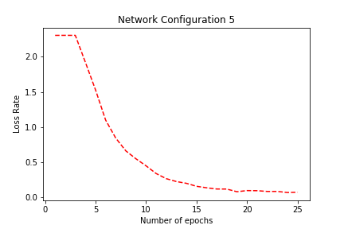

# Train convolutional neural networks (CNNs) to classify 10 classes of images (CIFAR-10) using PyTorch.

## Dataset:
The CIFAR-10 dataset consists of 60,000 natural images in 10 classes with 50,000 training images and 10,000 testing images.
Each image is an 3-channel color (RGB) image of 32x32 pixels in size.
The classes are ‘airplane’, ‘automobile’, ‘bird’, ‘cat’, ‘deer’, ‘dog’, ‘frog’, ‘horse’, ‘ship’, ‘truck’.

## Results:

<table style="direction: ltr; border-collapse: collapse; border: 1pt solid #A3A3A3;" border="1" cellspacing="0" cellpadding="0">
<tbody>
<tr>
<td style="vertical-align: top; width: .9708in; padding: 4pt 4pt 4pt 4pt; border: 1pt solid #A3A3A3;">
<ul style="margin-left: .3034in; direction: ltr; unicode-bidi: embed; margin-top: 0in; margin-bottom: 0in;">
<ol style="margin-left: 0in; direction: ltr; unicode-bidi: embed; margin-top: 0in; margin-bottom: 0in; font-family: Tahoma; font-size: 14.0pt; font-weight: bold; font-style: normal;" type="A">
<li style="margin-top: 0; margin-bottom: 0; vertical-align: middle; font-weight: bold;" value="19">No</li>
</ol>
</ul>
</td>
<td style="vertical-align: top; width: 2.5118in; padding: 4pt 4pt 4pt 4pt; border: 1pt solid #A3A3A3;">

Network Configuration

</td>
<td style="vertical-align: top; width: 1.1888in; padding: 4pt 4pt 4pt 4pt; border: 1pt solid #A3A3A3;">

Epochs

</td>
<td style="vertical-align: top; width: 1.5729in; padding: 4pt 4pt 4pt 4pt; border: 1pt solid #A3A3A3;">

Training Time

</td>
<td style="vertical-align: top; width: 1.0229in; padding: 4pt 4pt 4pt 4pt; border: 1pt solid #A3A3A3;">

Accuracy

</td>
</tr>
<tr>
<td style="vertical-align: top; width: .893in; padding: 4pt 4pt 4pt 4pt; border: 1pt solid #A3A3A3;">

1

</td>
<td style="vertical-align: top; width: 2.5118in; padding: 4pt 4pt 4pt 4pt; border: 1pt solid #A3A3A3;">

Network Configuration 1

</td>
<td style="vertical-align: top; width: 1.1888in; padding: 4pt 4pt 4pt 4pt; border: 1pt solid #A3A3A3;">

2 epochs

</td>
<td style="vertical-align: top; width: 1.5534in; padding: 4pt 4pt 4pt 4pt; border: 1pt solid #A3A3A3;">

12.6 min

</td>
<td style="vertical-align: top; width: .9194in; padding: 4pt 4pt 4pt 4pt; border: 1pt solid #A3A3A3;">

55 %

</td>
</tr>
<tr>
<td style="vertical-align: top; width: .893in; padding: 4pt 4pt 4pt 4pt; border: 1pt solid #A3A3A3;">

2

</td>
<td style="vertical-align: top; width: 2.5312in; padding: 4pt 4pt 4pt 4pt; border: 1pt solid #A3A3A3;">

Network Configuration 1_2

</td>
<td style="vertical-align: top; width: 1.1888in; padding: 4pt 4pt 4pt 4pt; border: 1pt solid #A3A3A3;">

50 epochs

</td>
<td style="vertical-align: top; width: 1.5534in; padding: 4pt 4pt 4pt 4pt; border: 1pt solid #A3A3A3;">

6.5 hr

</td>
<td style="vertical-align: top; width: .9194in; padding: 4pt 4pt 4pt 4pt; border: 1pt solid #A3A3A3;">

59 %

</td>
</tr>
<tr>
<td style="vertical-align: top; width: .893in; padding: 4pt 4pt 4pt 4pt; border: 1pt solid #A3A3A3;">

3

</td>
<td style="vertical-align: top; width: 2.5118in; padding: 4pt 4pt 4pt 4pt; border: 1pt solid #A3A3A3;">

Network Configuration 2

</td>
<td style="vertical-align: top; width: 1.1888in; padding: 4pt 4pt 4pt 4pt; border: 1pt solid #A3A3A3;">

2 epochs

</td>
<td style="vertical-align: top; width: 1.5534in; padding: 4pt 4pt 4pt 4pt; border: 1pt solid #A3A3A3;">

26.8 min

</td>
<td style="vertical-align: top; width: .9194in; padding: 4pt 4pt 4pt 4pt; border: 1pt solid #A3A3A3;">

59 %

</td>
</tr>
<tr>
<td style="vertical-align: top; width: .893in; padding: 4pt 4pt 4pt 4pt; border: 1pt solid #A3A3A3;">

4

</td>
<td style="vertical-align: top; width: 2.5312in; padding: 4pt 4pt 4pt 4pt; border: 1pt solid #A3A3A3;">

Network Configuration 2_2

</td>
<td style="vertical-align: top; width: 1.1888in; padding: 4pt 4pt 4pt 4pt; border: 1pt solid #A3A3A3;">

50 epochs

</td>
<td style="vertical-align: top; width: 1.5534in; padding: 4pt 4pt 4pt 4pt; border: 1pt solid #A3A3A3;">

6 hr

</td>
<td style="vertical-align: top; width: .9194in; padding: 4pt 4pt 4pt 4pt; border: 1pt solid #A3A3A3;">

67 %

</td>
</tr>
<tr>
<td style="vertical-align: top; width: .893in; padding: 4pt 4pt 4pt 4pt; border: 1pt solid #A3A3A3;">

5

</td>
<td style="vertical-align: top; width: 2.5118in; padding: 4pt 4pt 4pt 4pt; border: 1pt solid #A3A3A3;">

Network Configuration 3

</td>
<td style="vertical-align: top; width: 1.1888in; padding: 4pt 4pt 4pt 4pt; border: 1pt solid #A3A3A3;">

50 epochs

</td>
<td style="vertical-align: top; width: 1.5534in; padding: 4pt 4pt 4pt 4pt; border: 1pt solid #A3A3A3;">

14.14 hr

</td>
<td style="vertical-align: top; width: .9194in; padding: 4pt 4pt 4pt 4pt; border: 1pt solid #A3A3A3;">

72 %

</td>
</tr>
<tr>
<td style="vertical-align: top; width: .893in; padding: 4pt 4pt 4pt 4pt; border: 1pt solid #A3A3A3;">

6

</td>
<td style="vertical-align: top; width: 2.5118in; padding: 4pt 4pt 4pt 4pt; border: 1pt solid #A3A3A3;">

Network Configuration 4

</td>
<td style="vertical-align: top; width: 1.1888in; padding: 4pt 4pt 4pt 4pt; border: 1pt solid #A3A3A3;">

25 epochs

</td>
<td style="vertical-align: top; width: 1.5534in; padding: 4pt 4pt 4pt 4pt; border: 1pt solid #A3A3A3;">

15.55 hr

</td>
<td style="vertical-align: top; width: .9194in; padding: 4pt 4pt 4pt 4pt; border: 1pt solid #A3A3A3;">

74 %

</td>
</tr>
<tr>
<td style="vertical-align: top; width: .893in; padding: 4pt 4pt 4pt 4pt; border: 1pt solid #A3A3A3;">

7

</td>
<td style="vertical-align: top; width: 2.5118in; padding: 4pt 4pt 4pt 4pt; border: 1pt solid #A3A3A3;">

Network Configuration 5

</td>
<td style="vertical-align: top; width: 1.1888in; padding: 4pt 4pt 4pt 4pt; border: 1pt solid #A3A3A3;">

25 epochs

</td>
<td style="vertical-align: top; width: 1.5534in; padding: 4pt 4pt 4pt 4pt; border: 1pt solid #A3A3A3;">

28 hr

</td>
<td style="vertical-align: top; width: .9194in; padding: 4pt 4pt 4pt 4pt; border: 1pt solid #A3A3A3;">

80 %

</td>
</tr>
<tr>
<td style="vertical-align: top; width: .893in; padding: 4pt 4pt 4pt 4pt; border: 1pt solid #A3A3A3;">

8

</td>
<td style="vertical-align: top; width: 2.5312in; padding: 4pt 4pt 4pt 4pt; border: 1pt solid #A3A3A3;">

Network Configuration 5_1

</td>
<td style="vertical-align: top; width: 1.1888in; padding: 4pt 4pt 4pt 4pt; border: 1pt solid #A3A3A3;">

50 epochs

</td>
<td style="vertical-align: top; width: 1.5534in; padding: 4pt 4pt 4pt 4pt; border: 1pt solid #A3A3A3;">

60.8 hr

</td>
<td style="vertical-align: top; width: .9194in; padding: 4pt 4pt 4pt 4pt; border: 1pt solid #A3A3A3;">

80 %

</td>
</tr>
<tr>
<td style="vertical-align: top; width: .893in; padding: 4pt 4pt 4pt 4pt; border: 1pt solid #A3A3A3;">

9

</td>
<td style="vertical-align: top; width: 2.5312in; padding: 4pt 4pt 4pt 4pt; border: 1pt solid #A3A3A3;">

Network Configuration 5_2

</td>
<td style="vertical-align: top; width: 1.2083in; padding: 4pt 4pt 4pt 4pt; border: 1pt solid #A3A3A3;">

100 epochs

</td>
<td style="vertical-align: top; width: 1.5534in; padding: 4pt 4pt 4pt 4pt; border: 1pt solid #A3A3A3;">

132 hr

</td>
<td style="vertical-align: top; width: .9194in; padding: 4pt 4pt 4pt 4pt; border: 1pt solid #A3A3A3;">

54 %

</td>
</tr>
</tbody>
</table>

## Network Configuration 5

