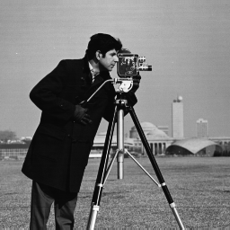
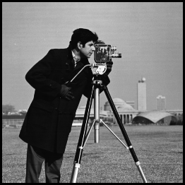
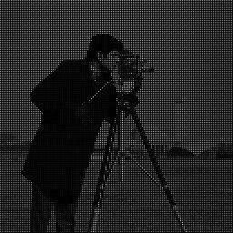
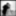
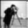
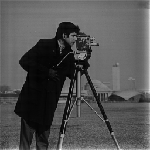

# Gaussian and Laplacian Pyramids
- Implementation of Gaussian kernel
- Zero padding border policy
- Blurring the image using Gaussian kernel
- Sub-sample an image
- Image expansion - Spreading the pixels
- Image expansion - Bilinear interpolation
- Gaussian Pyramid
- Laplacian Pyramid
 
Original Image: 

Zero padding border policy: 

Blurring the image using Gaussian kernel: 

Sub-sample an image: 

Image expansion - Spreading the pixels: 

Image expansion - Bilinear interpolation: 

Gaussian Pyramid: 

Laplacian Pyramid: 

