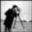
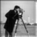

# Gaussian and Laplacian Pyramids
- Implementation of Gaussian kernel
- Zero padding border policy
- Blurring the image using Gaussian kernel
- Sub-sample an image
- Image expansion - Spreading the pixels
- Image expansion - Bilinear interpolation
- Gaussian Pyramid
- Laplacian Pyramid
 
Original Image:

Zero padding border policy:

Blurring the image using Gaussian kernel:

Sub-sample an image:

Image expansion - Spreading the pixels:

Image expansion - Bilinear interpolation:

Gaussian Pyramid:

Laplacian Pyramid:

