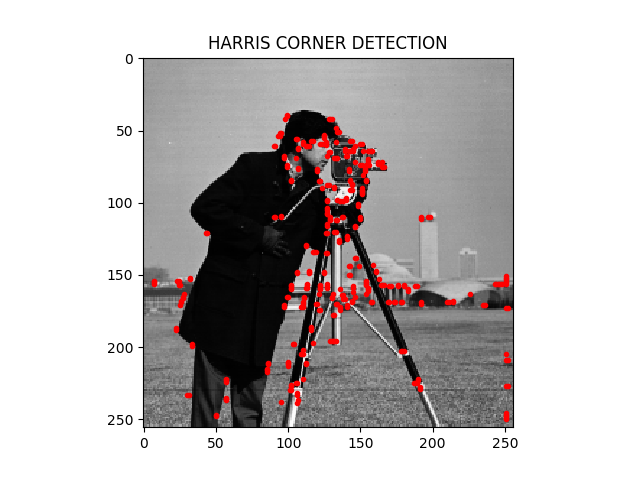
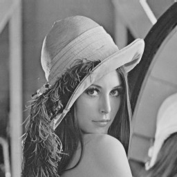
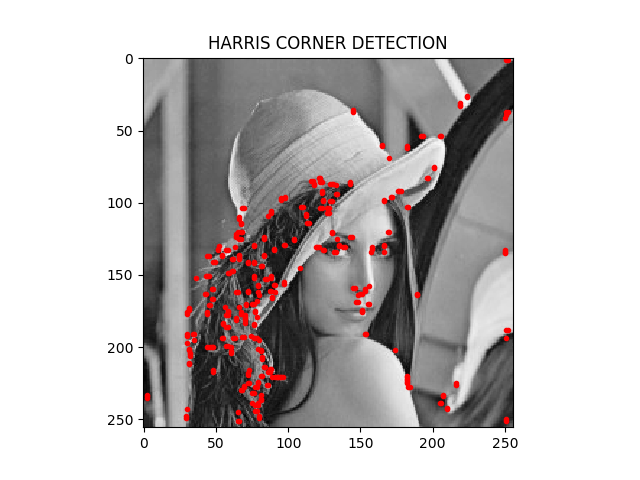

# Harris Corner Detection
- Compute the intensity gradient in horizontal and vertical direction using Sobel Filter
- Gaussian smoothing
- Harris Corner Detection

 

Original Image: 

Harris Corner Detection: 

Blurring the image using Gaussian kernel: 

Original Image: 

Harris Corner Detection: 

